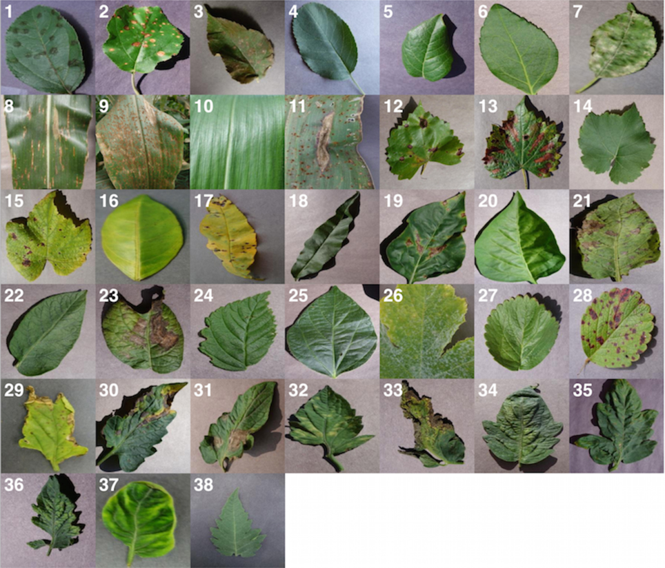

# PlantVillage Dataset


The **PlantVillage Dataset** is an open access repository of **54,306 images** of healthy and diseased plant leaves, collected to advance research in automated plant disease diagnosis. It covers **14 crop species** and **26 diseases**, making it one of the largest publicly available datasets for computer vision in agriculture.

This dataset was introduced in the paper [**"Using Deep Learning for Image-Based Plant Disease Detection"**](https://public-pages-files-2025.frontiersin.org/journals/plant-science/articles/10.3389/fpls.2016.01419/pdf) by Mohanty et al. (2016). The goal of this work is to enable the development of smartphone-based disease diagnosis systems to help farmers worldwide safeguard their yields.

## Dataset Structure

The repository is organized as follows:

-   `raw/`: Contains the raw image data, categorized into versions:
    -   `color/`: Original RGB images.
    -   `grayscale/`: Grayscale versions of the raw images.
    -   `segmented/`: RGB images with just the leaf segmented and color corrected.
-   `scripts/`: Contains shell scripts for data generation and processing (e.g., `generate_data_*.sh`).
-   `logs/`: Archives of SLURM job logs from previous data generation runs.
-   `create_db.py` & other Python scripts: Core scripts for creating LMDB/HDF5 databases from the images.

## Usage

**Requirement**: This codebase was written for **Python 2.7**. Please ensure you have a Python 2 environment.

### Download Dataset
With [git](https://git-scm.com/downloads) installed:
```bash
git clone https://github.com/spMohanty/PlantVillage-Dataset
cd PlantVillage-Dataset
```

### Data Generation
The shell scripts in `scripts/` utilize `create_db.py` to generate different versions of the dataset. 
**Note**: These scripts may contain hardcoded paths specific to the original cluster environment. They are provided for reference.

To run the Python tools directly (using Python 2):
```bash
python2 create_db.py --help
```

## Citation

If you use this dataset, please consider citing: 
```bibtex
@article{Mohanty_Hughes_Salathé_2016,
title={Using deep learning for image-based plant disease detection},
volume={7},
DOI={10.3389/fpls.2016.01419},
journal={Frontiers in Plant Science},
author={Mohanty, Sharada P. and Hughes, David P. and Salathé, Marcel},
year={2016},
month={Sep}} 
```

## Contact
In case of any confusion, please contact `sharada.mohanty@epfl.ch`.
